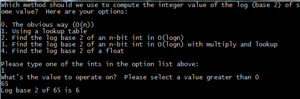

# Bit-Twiddling Hacks #

## Summary ##

This is a compilation of shortcuts involving tricks with bits. This program is a means to play around and interact with those shortcuts.

## Description ##

I love C because it allows you to take shortcuts in terms of speed and code, even though there's a pretty high risk things will go wrong (and they usually do). When I stumbled upon [a compilation of bit hacks](http://www-graphics.stanford.edu/~seander/bithacks.html), I immediately was interested and started copying them in a more user friendly way. This is basically copying the code on the site and putting it in working C code, mostly so that I could play with it. 

I'll be adding some thorough documentation soon, but the above link does well to explain what these hacks do and what they mean. 

You can run the binary on any Unix-based machine.

## Screenshots ##

#### Menu ####

#### Log 2 ####

#### Mod division ####

#### Next highest power ####

